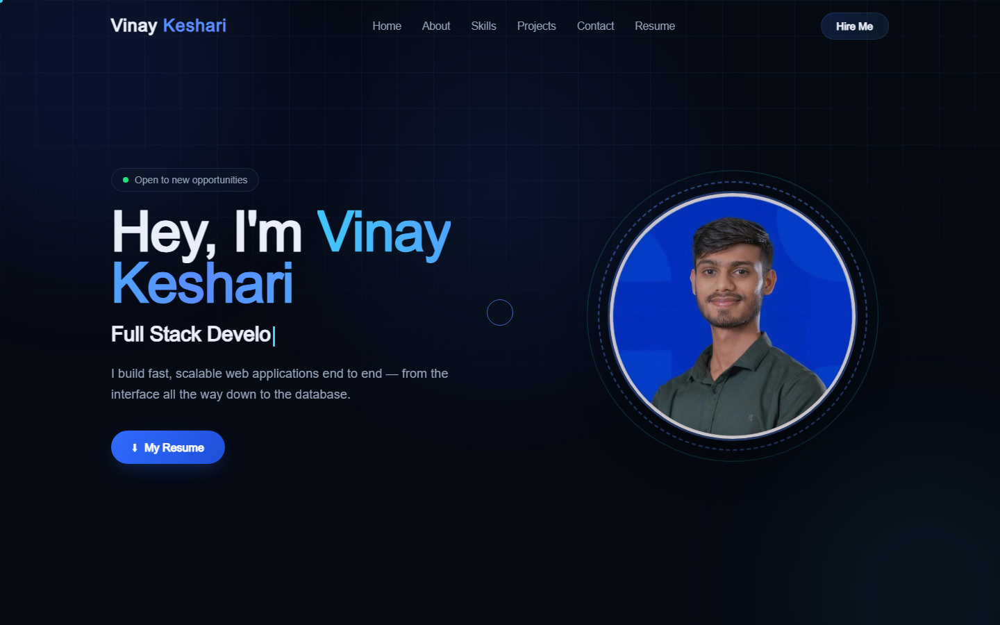
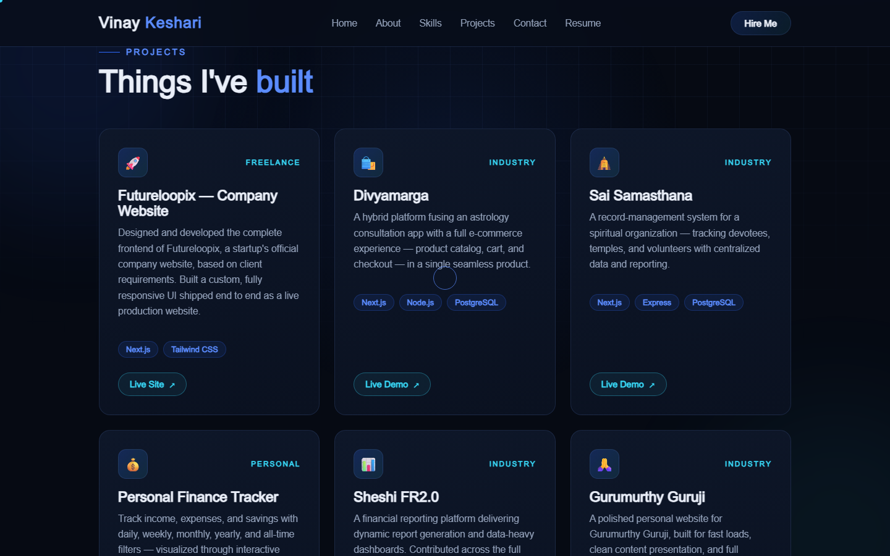

# Vinay Keshari — Developer Portfolio

### 👉 **[Open the live portfolio — portfolio-vinayk-alpha.vercel.app](https://portfolio-vinayk-alpha.vercel.app/)**

**No login. No sign-up. No account needed — just click and browse.**

A personal portfolio built with Next.js showcasing my work as a Full Stack Developer
(MERN & Next.js). Everything on the site is public: every section, every project link,
and the resume itself are open to anyone.



---

## Quick links

| What | Where |
|---|---|
| Live site | https://portfolio-vinayk-alpha.vercel.app/ |
| Resume (direct PDF, no login) | https://portfolio-vinayk-alpha.vercel.app/Vinay_Keshari_Resume.pdf |
| LinkedIn | https://www.linkedin.com/in/vinay-keshari-301125240/ |
| GitHub | https://github.com/vkeshari23 |
| Email | vinaykeshari076@gmail.com |

---

## Projects featured



| Project | Live link | Access |
|---|---|---|
| Futureloopix — Company Website | https://www.futureloopix.com/ | Open to everyone |
| Divya Maarg | https://preview.divyamaarg.com/ | Open to everyone |
| Sai Samsthana | https://saisamsthana.app/ | Staff CRM — opens on a login screen |
| MoneyMap — Personal Finance Tracker | https://pft-rkx5.vercel.app/ | Landing page is public; dashboard needs an account |
| Sheshi FR2.0 | — | Internal company product, no public deployment |
| Gurumurthy Guruji | — | Client-owned, no public link |
| Live Video Conferencing | — | Under development |

> Two of the demos above sit behind a login because they are real products with real
> user data, not public marketing sites. The portfolio labels these clearly so nobody
> hits an unexplained wall.

---

## Tech stack

- **Framework:** Next.js 14 (App Router)
- **Language:** JavaScript (React 18)
- **Styling:** Plain CSS with custom properties — no UI library
- **Fonts:** Sora + Inter via `next/font`
- **Hosting:** Vercel

## Sections

`Home` · `About` (experience, career progression, education) · `Skills` (technical + soft)
· `Projects` · `Achievements` · `Resume` · `Contact`

The nav bar is fixed, so it stays put while you scroll. The resume opens in a new tab
and downloads at the same time from every place it appears.

---

## Run locally

```bash
git clone https://github.com/vkeshari23/portfolio-vinayk.git
cd portfolio-vinayk
npm install
npm run dev
```

Then open http://localhost:3000

## Build

```bash
npm run build
npm start
```

---

Designed & built by **Vinay Keshari** — Varanasi, India
